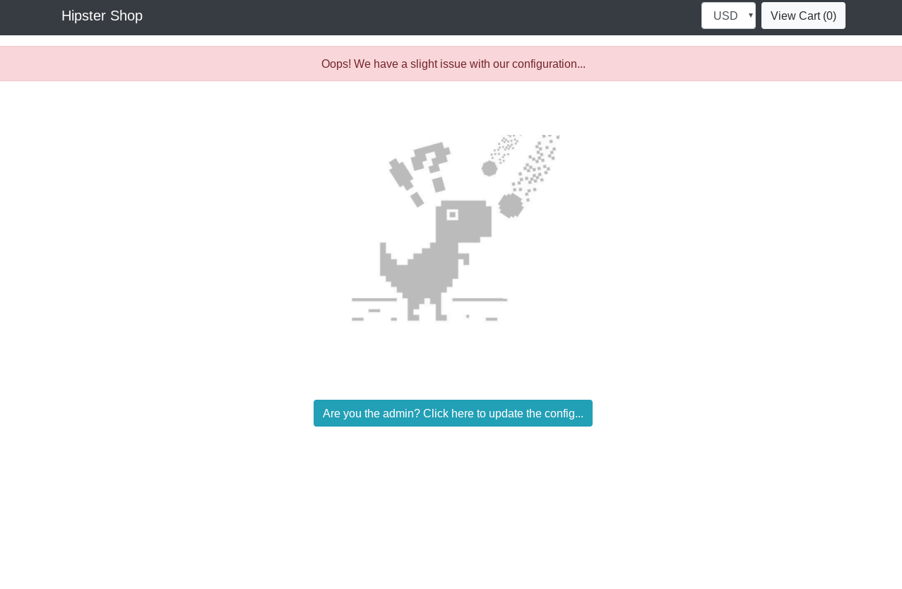
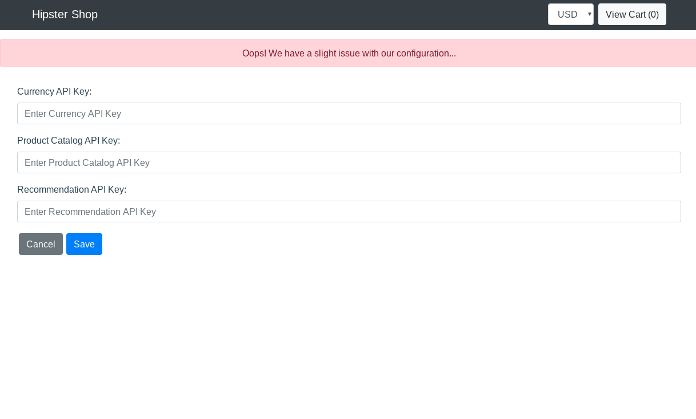

# Hipster API Demo

This is a fork of the original Hipster APIM demo with the following changes:

- Simplified microservices, reduced to 4 to reduce deployment footprint
- Removed gRPC communication, replaced with HTTP
- Replaced the manually installed Istio with the GKE Add-On Istio (in beta)
- Removed Jaeger logging, replaced with Stackdriver

## Install

#### Tool Prerequisites

`gcloud`
`kubectl`
`apigee-istio`

#### Information Prerequisite
Set your Google Cloud Project ID

```
export PROJECT_ID=<gcp-project-id>
export ZONE=us-central1-a
export CLUSTER_NAME=my-cluster
```

#### Download the repo
```
export HIPSTER_VERSION=1.3.0

mkdir -p hipster-apim-demo && cd hipster-apim-demo && curl -L https://github.com/tyayers/hipster-apim-demo/archive/$HIPSTER_VERSION.tar.gz | tar xvz --strip-components=1
```

##### Setup GKE

```
gcloud config set project ${PROJECT_ID}

gcloud container clusters create ${CLUSTER_NAME} \
    --machine-type=n1-standard-2 \
    --num-nodes 3 \
    --enable-autoscaling --min-nodes 1 --max-nodes 10 \
    --cluster-version=1.13 \
    --zone=${ZONE} \
    --addons=Istio --istio-config=auth=MTLS_PERMISSIVE \
    --enable-stackdriver-kubernetes \
    --no-enable-legacy-authorization

```

#### Install Hispter
```
kubectl apply -f istio-manifests/istio-gateways.yaml

kubectl apply -f kubernetes-manifests/currencyservice.yaml
kubectl apply -f kubernetes-manifests/productcatalogservice.yaml
kubectl apply -f kubernetes-manifests/recommendationservice.yaml
kubectl apply -f kubernetes-manifests/frontend.yaml

#wait for pods to be running , takes about a minute
watch kubectl get pods

```

### Test

```
export GATEWAY_URL=http://$(kubectl -n istio-system get service istio-ingressgateway -o jsonpath='{.status.loadBalancer.ingress[0].ip}')

#Get Recommendations
curl $GATEWAY_URL/recommendationservice/recommendations/OLJCESPC7Z

#Get Currencies
curl $GATEWAY_URL/currencyservice/currencies

#Get List of Products
curl $GATEWAY_URL/productcatalogservice/products

#Open Hipster Frontend in web browser
Copy the IP address returned as GATEWAY_URL and copy into any web browser URL field
```
Explore the API endpoints in folder `specs/demo.http.swagger.json`


### Apigee Demo

#### Install Apigee Adapter

```
#This section assumes, you are running these steps from a Google Cloud shell, if you are running it on your own machine, make sure you download the correct binary for the apigee adapter depending on your OS

export APIGEE_ISTIO_DIR=istio-mixer-adapter;

export APIGEE_ISTIO_DOWNLOAD_URL=https://github.com/apigee/istio-mixer-adapter/releases/download/1.1.3/istio-mixer-adapter_1.1.3_linux_64-bit.tar.gz;

mkdir -p $APIGEE_ISTIO_DIR && cd $APIGEE_ISTIO_DIR && curl -L $APIGEE_ISTIO_DOWNLOAD_URL | tar xvz

./apigee-istio provision --grpc -o [org] -e [env] -u [username] -p [password] > samples/apigee/grpc/handler.yaml

kubectl apply -f samples/apigee/grpc/apigee-adapter.yaml
kubectl apply -f samples/apigee/grpc/definitions.yaml
kubectl apply -f samples/apigee/grpc/handler.yaml

cd ..
```

#### Enable API Key based Authentication
```
kubectl apply -f istio-manifests/rule.yaml

#Get List of Products or other URLs to get ads, or currencies we used earlier
curl $GATEWAY_URL/productcatalogservice/products

#The above will fail with HTTP 403
```

Follow instructions [here](https://docs.apigee.com/api-platform/istio-adapter/install-istio_1_1#get_an_api_key) to get a valid API Key and access the APIs


#### Hipster App client Apigee Demo

```
# Disable the Apigee Mixer plugin rule if enabled earlier
kubectl delete -f demo/rule.yaml

# Export FRONTEND_URL to navigate to Hipster App
export FRONTEND_URL=http://$(kubectl get service frontend-external -o jsonpath='{.status.loadBalancer.ingress[0].ip}')
```

* Launch the FRONTEND_URL in a modern browser (Chrome/Safari/Firefox) and navigate around the Hipster Shop. For OSX `open $FRONTEND_URL`
  * _This will succeed without any errors_


```
#Re-apply the Apigee Mixer plugin rule to enforce authorization
kubectl apply -f demo/rule.yaml
```
* Navigate around the Hipster Shop again in your browser.
  * _This will partially fail with HTTP 500 and HTTP 403 errors_



* Generate a Developer and an API Product with the appropriate service names [example](https://docs.apigee.com/api-platform/istio-adapter/installation#get_an_api_key). You will need to add at least the following to the API Product Istio Services:
```
productcatalogservice.default.svc.cluster.local
recommendationservice.default.svc.cluster.local
currencyservice.default.svc.cluster.local
cartservice.default.svc.cluster.local
```

* Create an Apigee application with the above API Product either in the Management UI or an Apigee developer portal [example](https://docs.apigee.com/api-platform/istio-adapter/installation#4_create_a_developer_app)

* Copy the Apigee application Client ID above, add the Client ID to the Hipster App configuration, and click the **Save** button. `$FRONTEND_URL/config`



* Navigate around the Hipster Shop again in your browser!
  * _This will succeed without any errors for the services you added to the API Product_


### KNOWN ISSUES


